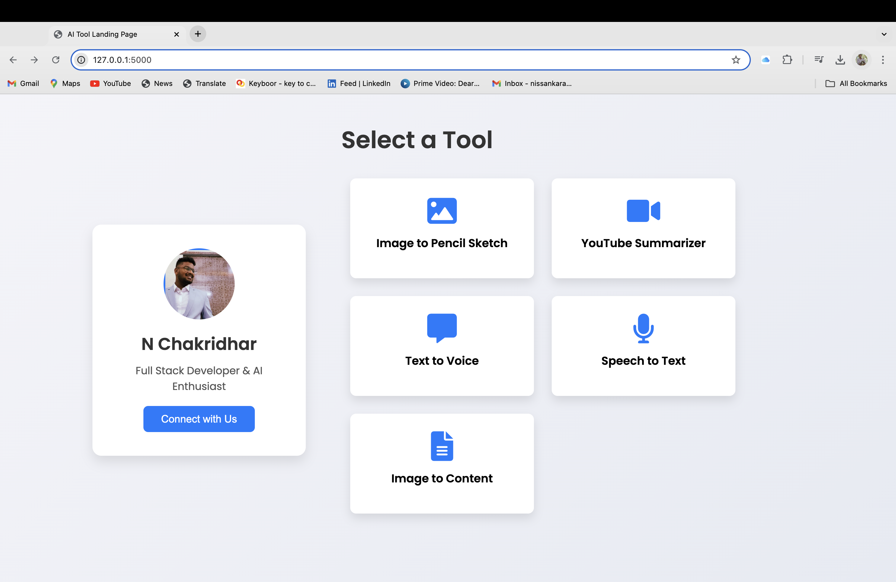
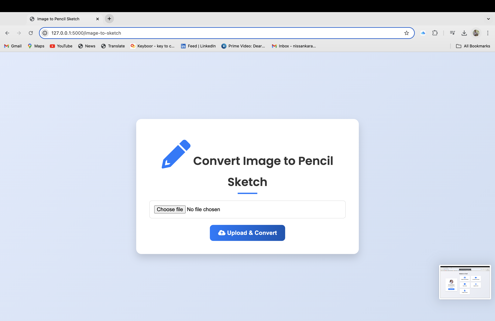
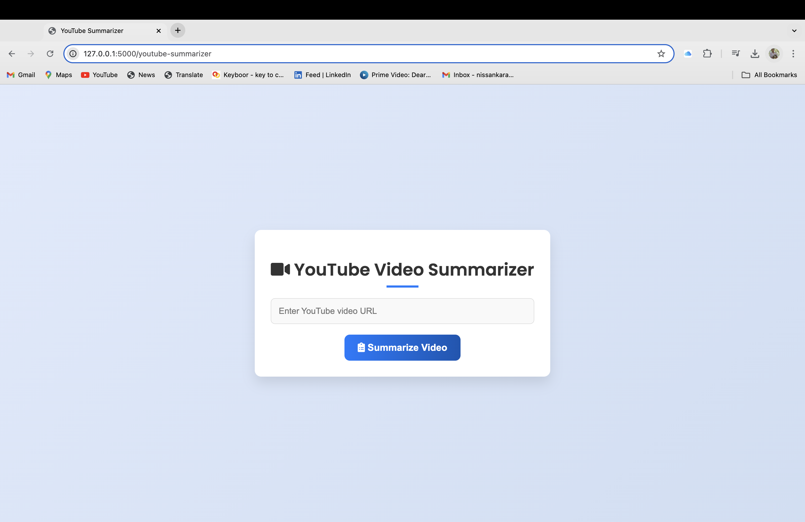
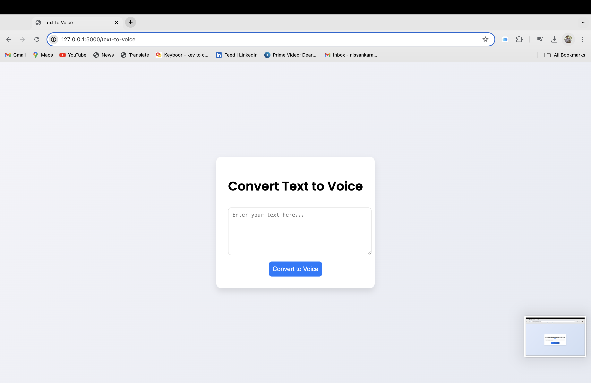
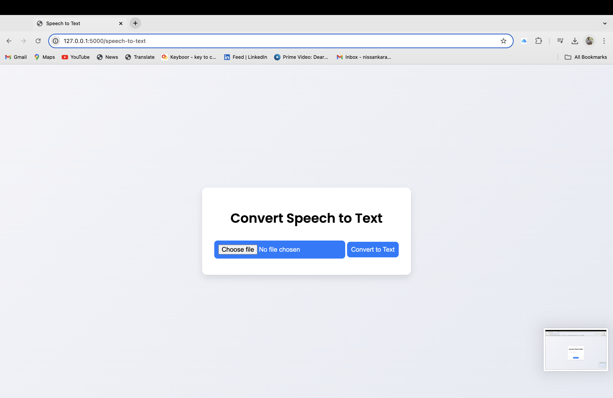
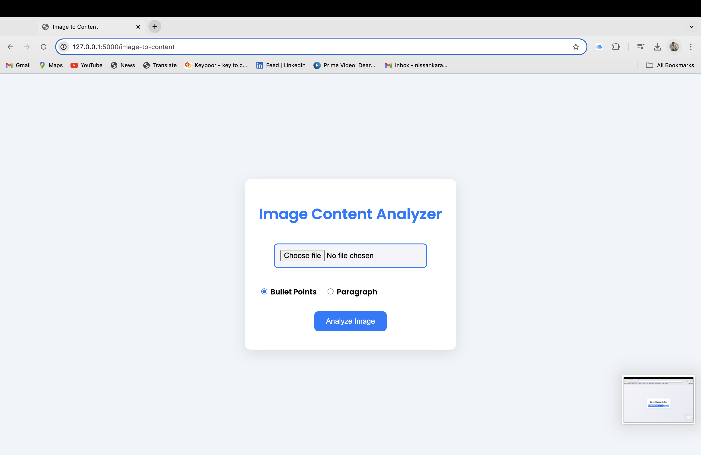

# AI Tool Suite

## Overview

The **AI Tool Suite** is a web application that provides multiple tools to help with various tasks such as:

- Image to Pencil Sketch: Upload an image to convert it into a pencil sketch.
- YouTube Summarizer: Get a summary of a YouTube video by providing its URL.
- Text to Voice: Convert text into speech and download the audio.
- Speech to Text: Upload an audio file and convert speech into text.
- Image to Content: Upload an image and get a detailed analysis using Google Cloud Vision API.
- OpenAI Integration: Summarize content, generate text, or process user inputs with the ChatGPT API.

## Table of Contents

1. [Features](#features)
2. [Demo](#demo)
3. [Installation](#installation)
4. [Usage](#usage)
5. [API Integration](#api-integration)
6. [Folder Structure](#folder-structure)
7. [Technology Stack](#technology-stack)
8. [Developer Information](#developer-information)

## Features

1. **Image to Pencil Sketch**
   - Upload an image (PNG, JPG, JPEG) and convert it to a pencil sketch.
   
2. **YouTube Summarizer**
   - Provide a YouTube video URL, and the app generates a short summary.
   
3. **Text to Voice**
   - Convert text input to speech using `gTTS` and download the audio file.
   
4. **Speech to Text**
   - Upload an audio file (WAV, MP3, etc.), and the app converts the speech to text using Google Speech Recognition.
   
5. **Image to Content**
   - Analyze the content of an uploaded image using Google Cloud Vision API and get the description as bullet points or a paragraph.
   
6. **OpenAI Integration (ChatGPT)**
   - Use the OpenAI API for text generation and summarization.
## Demo

### Landing Page



### Image to Pencil Sketch



### YouTube Summarizer



### Text to Voice



### Speech to Text



### Image Analyzer




## Installation

### Prerequisites

- Python 3.7 or later
- Google Cloud Vision API credentials
- OpenAI API Key
- `pip` installed for Python dependencies

### Step-by-Step Setup

1. **Clone the repository:**

    ```bash
    git clone https://github.com/Chakridhar2555/Choosing-Ai-tools-.git
    ```

2. **Create a virtual environment:**

    ```bash
    python3 -m venv venv
    source venv/bin/activate  # On Windows use `venv\Scripts\activate`
    ```

3. **Install required dependencies:**

    ```bash
    pip install -r requirements.txt
    ```

4. **Setup environment variables:**

    Create a `.env` file in the root directory of your project and add the following:

    ```bash
    GOOGLE_APPLICATION_CREDENTIALS=path_to_your_google_cloud_credentials.json
    OPENAI_API_KEY=your_openai_api_key_here
    ```

5. **Set up Google Cloud Vision:**

    - Go to the [Google Cloud Console](https://console.cloud.google.com/).
    - Create a project and enable the Vision API.
    - Create and download your service account key in JSON format.
    - Save the key file and set its path in your `.env` file.

6. **Run the application:**

    ```bash
    python app.py
    ```

7. **Access the application:**

    Open your browser and navigate to `http://127.0.0.1:5000/`.

## Usage

Once the app is running, you will be presented with a landing page featuring several tools. You can choose from the available tools such as "Image to Pencil Sketch", "YouTube Summarizer", "Text to Voice", "Speech to Text", "Image to Content", and OpenAI features.

Each tool has a corresponding form where you can upload files or input the required information. The application processes the inputs and provides results such as image transformations, audio file downloads, or text summaries.

### Example Usage

1. **Image to Pencil Sketch:**
   - Click on "Image to Pencil Sketch."
   - Upload an image file, and the app will generate a sketch version of the image.
   
2. **YouTube Summarizer:**
   - Enter a YouTube URL and get a summarized version of the video's transcript.
   
3. **OpenAI Integration (ChatGPT):**
   - Summarize content or ask ChatGPT to generate text-based responses.

## API Integration

### OpenAI API

This project uses the **OpenAI API** for tasks such as generating text responses, summarization, and more. To use OpenAI, you'll need an API key from [OpenAI's API](https://beta.openai.com/signup/).

To use this:
1. Sign up on OpenAI’s platform and get your API key.
2. Add your API key to the `.env` file as shown above.

### Google Cloud Vision API

This project uses the **Google Cloud Vision API** for analyzing images in the "Image to Content" feature.

To use this:
1. Create a Google Cloud account.
2. Enable the Vision API.
3. Add your credentials to the `.env` file as described in the [Installation](#installation) section.

### Other Libraries Used:
- **gTTS (Google Text-to-Speech):** For text-to-voice conversion.
- **SpeechRecognition:** For speech-to-text conversion.
- **OpenCV:** For image manipulation (sketch conversion).
- **YouTubeTranscriptAPI:** For fetching and summarizing YouTube video transcripts.

## Folder Structure

```bash
ai-tool-suite/
│
├── static/
│   ├── audio/        # Audio files saved after text-to-speech conversions
│   └── uploads/      # Image and audio uploads
├── templates/
│   ├── landing.html  # Main landing page for selecting tools
│   ├── image_to_sketch.html
│   ├── youtube_summarizer.html
│   ├── text_to_voice.html
│   ├── speech_to_text.html
│   └── image_to_content.html
├── app.py            # Main application logic (Flask routes and functionality)
├── .env              # Environment variables for Google Cloud Vision and OpenAI credentials
├── requirements.txt  # Python dependencies
└── README.md         # Project documentation
